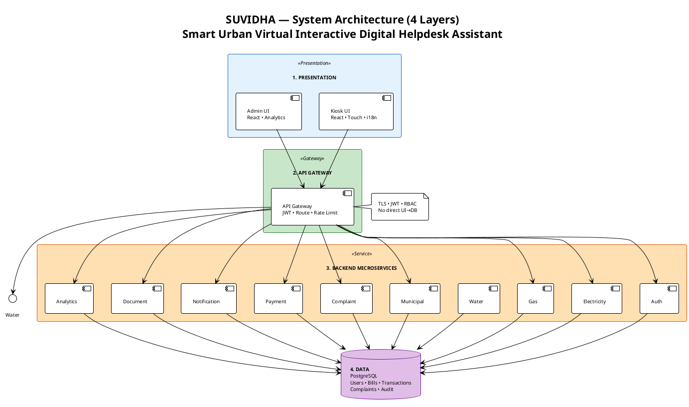

# What to Add in the Document (Proforma — Section 5)

Use this when filling **Section 5: Technical Design & Architecture** in the Technical Proposal (Proforma).

---

## 5.2 System Architecture Diagram — What to Add

**In the form:** Where it says *"Upload Architecture Diagram (PNG/PDF/Link)"* or *"Attach a diagram"*:

### Option A (Recommended): Attach one PNG

1. **Generate the image** from this PlantUML file:
   - **File:** `SUVIDHA_Architecture_For_Document.puml` (compact, one-page)  
   - **Or:** `SUVIDHA_Component_Architecture.puml` (full detail)
2. **How to generate PNG:**
   - Open [PlantUML Online](https://www.plantuml.com/plantuml/uml/) → paste the full contents of the `.puml` file → Submit → Export **PNG**.
   - Or in VS Code: open the `.puml` file → install PlantUML extension → `Alt+D` to preview → Export as PNG.
3. **Attach** the PNG to the Word document (Insert → Picture → select the PNG), or upload it where the form asks for diagram/file.
4. **Caption (paste below the diagram in the document):**  
   *"Figure: SUVIDHA system architecture — 4 layers (Presentation, API Gateway, Backend Microservices, Data). All client traffic via Gateway; microservices access PostgreSQL; no direct UI–database access."*

### Option B: Use existing image

If you already have **SUVIDHA_System_Architecture.png** in this folder and it shows the 4 layers and main components, you can attach that same image. Ensure it shows: Kiosk UI, Admin UI, API Gateway, microservices (Auth, Electricity, Gas, Water, Municipal, Complaint, Payment, Notification, Document, Analytics), and PostgreSQL.

---

## 5.3 Workflow & Data Flow — Text to Paste

**Paste this in the "Workflow & Data Flow" or "Explain how data moves" section:**

---

**Citizen — Login:** Kiosk UI sends mobile number to API Gateway → Gateway forwards to Auth Service → Auth generates/stores OTP and returns success → User enters OTP → Kiosk sends OTP to Gateway → Auth validates OTP, creates/retrieves user, issues JWT → Kiosk stores token and shows service selection.

**Citizen — Bill payment:** User selects service (e.g. Electricity) and enters Consumer ID → Kiosk calls Gateway (with JWT) → Gateway verifies JWT and routes to Electricity Service → Service fetches bill from PostgreSQL and returns it → User confirms payment → Kiosk calls Payment API via Gateway → Payment Service records transaction and requests receipt from Document Service → Document Service generates PDF/HTML → Kiosk displays confirmation and allows print.

**Citizen — Complaint:** User submits category, description, priority via Kiosk → Gateway forwards to Complaint Service → Service saves to PostgreSQL and returns reference number → User can later track status by calling Gateway with reference number; Complaint Service returns status from DB.

**Admin:** Admin logs in (separate role); Gateway issues JWT with role=admin. Admin UI fetches dashboard counts and complaint list via Gateway → Analytics and Complaint services read from PostgreSQL. Admin updates complaint status and publishes advisories; Notification Service stores advisories; Kiosk fetches active advisories on interval. All data moves through services only; UI never accesses the database directly.

---

## PlantUML Code for the Document Diagram

Use **one** of these to generate the image you attach:

1. **Compact (one-page):** `SUVIDHA_Architecture_For_Document.puml` — already in this folder; copy its entire contents into PlantUML online or your editor and export PNG.
2. **Full (detailed):** `SUVIDHA_Component_Architecture.puml` — same folder; use if you prefer more detail and have space for a larger figure.

No need to paste the raw PlantUML code into the Word document; only the **generated PNG** (and optional caption above) goes in the proposal.

---

## 5.3 Workflow Diagrams — 3 Flow Diagrams (Optional)

For **Section 5.3 Workflow & Data Flow**, you can add these 3 activity diagrams alongside the text:

| Flow | File | Description |
|------|------|-------------|
| **Citizen** | `SUVIDHA_Flow_Citizen.puml` | Login → Service → Bill → Payment → Receipt |
| **Complaint** | `SUVIDHA_Flow_Complaint.puml` | Register (get ref) or Track (by ref) |
| **Admin** | `SUVIDHA_Flow_Admin.puml` | Dashboard → Complaints → Advisories → Reports |

Generate PNG from each file (PlantUML online or VS Code) and insert below the workflow text in the document.

---

## Full PlantUML Code (Copy-Paste to Generate Diagram)

Copy the block below into [PlantUML Online](https://www.plantuml.com/plantuml/uml/) or your PlantUML editor, then export PNG.

